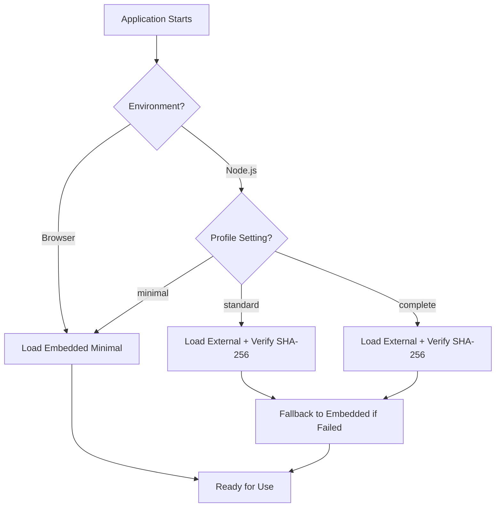

<!--
SPDX-License-Identifier: LGPL-3.0-or-later
-->

# Unicode Data Format & Security Architecture

This document explains how `@david-osipov/security-kit` handles Unicode data for identifier validation and confusable character detection. Understanding this architecture helps you make informed decisions about security profiles and performance trade-offs.

## Quick Start

The security kit uses a **hybrid approach** for maximum security and performance:

- **Frontend/Browser**: Embedded minimal profile (~877 bytes, negligible bundle impact)
- **Backend/Node.js**: Can load larger profiles with full confusables detection
- **All environments**: Cryptographic integrity verification (SHA-256)

```typescript
import { getUnicodeSecurityConfig, setUnicodeSecurityConfig } from '@david-osipov/security-kit';

// Configure Unicode profile
setUnicodeSecurityConfig({
  dataProfile: 'minimal',    // 'minimal' | 'standard' | 'complete'
  enableConfusablesDetection: true,
  maxInputLength: 2048
});
```

## Security Profiles

### 📱 Minimal Profile (Frontend-Optimized)
- **Size**: ~877 bytes total
- **Bundle Impact**: +1.7% (negligible)
- **Use Case**: Frontend applications, PWAs, mobile apps
- **Features**:
  - ✅ Unicode identifier validation (391 ranges)
  - ❌ No confusables detection (empty)
  - ✅ Embedded with integrity verification

### 🖥️ Standard Profile (Production Default)
- **Size**: ~80KB total
- **Bundle Impact**: External files (no bundle bloat)
- **Use Case**: Backend services, API servers
- **Features**:
  - ✅ Full Unicode identifier validation
  - ✅ Curated high-risk confusables (~79KB)
  - ✅ External files with SHA-256 verification

### 🔬 Complete Profile (Research/Analysis)
- **Size**: ~82KB total
- **Bundle Impact**: External files (no bundle bloat)
- **Use Case**: Security research, comprehensive analysis
- **Features**:
  - ✅ Full Unicode identifier validation
  - ✅ Complete confusables mappings (~81KB)
  - ✅ Maximum detection coverage

## Security Architecture

### Zero Trust & Verifiable Security (OWASP ASVS L3)

Every piece of Unicode data is cryptographically verified:

```typescript
// Automatic integrity verification on module load
import { getEmbeddedData } from '@david-osipov/security-kit/embedded';

const data = await getEmbeddedData(); // SHA-256 verified
```

**Security Features:**
- **Tamper Detection**: SHA-256 hashes prevent data corruption
- **Supply Chain Protection**: Embedded data can't be replaced
- **Fail-Safe Design**: Graceful degradation if external files unavailable
- **Memory Safety**: Bounds checking, integer overflow protection
- **Configurable Rejection Controls**: Fine-grained flags (`rejectBidiControls`, `rejectInvisibleChars`, `rejectIntroducedStructuralChars`, `rejectDangerousRanges`) default to secure fail-closed behavior and cannot be disabled in production (except bidi with an explicit override) maintaining OWASP ASVS L3 posture.
- **Integrity Enforcement Flag**: `requireUnicodeDataIntegrity` (defaults to true in production) ensures binary headers and future signatures are verified before data use; failures raise a typed `SecurityValidationError`.
 - **Digest Pinning**: A build script (`scripts/generate-unicode-digests.ts`) produces `src/generated/unicode-digests.ts` containing SHA-384 hashes. At runtime, hashes are recomputed and constant-time compared. If absent, header-only validation occurs (development), but production should always ship with populated digests.

### Hybrid Loading Strategy



## API Usage

### Basic Identifier Validation

```typescript
import { getIdentifierRanges, getIdentifierStatus } from '@david-osipov/security-kit';

// Check if code points are allowed in identifiers
const ranges = await getIdentifierRanges();
const status = await getIdentifierStatus(0x41); // 'A' -> 'Allowed'
```

### Confusables Detection

```typescript
import { getConfusables, isConfusable } from '@david-osipov/security-kit';

// Detect confusable characters
const isRisky = await isConfusable('а', 'a'); // Cyrillic vs Latin 'a'
const targets = await getConfusableTargets('а'); // ['a']
```

### Profile Management

```typescript
import { 
  getUnicodeSecurityConfig, 
  setUnicodeSecurityConfig 
} from '@david-osipov/security-kit';

// Get current configuration
const config = getUnicodeSecurityConfig();
console.log(`Current profile: ${config.dataProfile}`);

// Switch to different profile
setUnicodeSecurityConfig({
  dataProfile: 'standard',
  enableConfusablesDetection: true,
  lazyLoad: false // Eager load in production
});
```

## Performance Characteristics

### Bundle Size Impact

| Profile | Embedded Size | External Size | Bundle Impact |
|---------|---------------|---------------|---------------|
| Minimal | 877 bytes | - | +1.7% |
| Standard | 877 bytes | ~80KB | +1.7% |
| Complete | 877 bytes | ~82KB | +1.7% |

**Key Insight**: Only minimal data is embedded, so bundle size impact is always negligible.

### Runtime Performance

```typescript
// Fast operations (all profiles)
await getIdentifierStatus(codePoint);    // O(log n) binary search
await getIdentifierRanges();             // O(1) cached

// Variable performance by profile
await getConfusables();                  // minimal: O(1), others: O(n)
await isConfusable(char1, char2);        // minimal: O(1), others: O(n)
```

## Binary Format Details

Understanding the binary format helps with debugging and security auditing.

### Identifier Ranges Format (V2)

**Magic Header**: `U16R` (0x55, 0x31, 0x36, 0x52)

```
[4 bytes] Magic: "U16R"
[1 byte]  Version: 2
[3 bytes] Reserved: 000
[4 bytes] Range Count (little-endian)
[payload] Delta-compressed varints
```

**Compression**: ~73% size reduction via delta encoding + varints

### Confusables Format (V2)

**Magic Header**: `U16C` (0x55, 0x31, 0x36, 0x43)

```
[4 bytes]  Magic: "U16C"
[1 byte]   Version: 2
[1 byte]   Profile: 0=minimal, 1=standard, 2=complete
[2 bytes]  Reserved: 00
[4 bytes]  Single Code Point Count
[4 bytes]  Multi-Sequence Count
[4 bytes]  Multi-Sequence Data Size
[4 bytes]  Mapping Count
[8 bytes]  Reserved (future)
[payload]  Single table + Multi table + Mappings
```

**Features**: 
- Split single/multi tables for O(1) indexing
- Front-coding for multi-sequences (prefix compression)
- Variable-length mapping entries (3-5 bytes per mapping)

## Security Considerations

### Threat Model

| Threat | Mitigation |
|--------|------------|
| Malicious expansion attack | Hard caps (20,000 mappings max) |
| Binary corruption | SHA-256 verification + structural validation |
| Memory exhaustion | Allocation limits + bounds checking |
| Prototype pollution | Only primitive arrays/strings returned |
| Timing attacks | Constant-time operations where applicable |

### OWASP ASVS L3 Compliance

✅ **V8.1.1 - Data Integrity**: Cryptographic verification of all data
✅ **V5.2.1 - Input Validation**: Strict bounds checking and validation
✅ **V5.2.2 - Memory Management**: Memory exhaustion protection
✅ **V14.2.3 - Supply Chain Security**: Tamper-resistant embedded data

## Troubleshooting

### Common Issues

**Q: Bundle size increased significantly**
A: Check that you're not importing the wrong profile. The minimal profile should add <1KB.

**Q: Confusables detection not working**  
A: Minimal profile has zero confusables. Use `standard` or `complete` profile.

**Q: External files not loading**
A: Check file paths and permissions. The system will gracefully degrade to embedded minimal.

**Q: Integrity verification failures**
A: This indicates potential tampering. Check your build/deployment process.
  Ensure you regenerated digests after updating binary Unicode data:
  `npm run build:unicode-digests` (or direct ts-node invocation) before publishing.

### Debug Information

```typescript
import { getDataStats } from '@david-osipov/security-kit';

// Get current profile statistics
const stats = await getDataStats();
console.log(`Ranges: ${stats.ranges}, Confusables: ${stats.confusables}`);
console.log(`Total memory: ${stats.totalBytes} bytes`);
```

## Migration Guide

### From Other Unicode Libraries

```typescript
// Before (other library)
import { isValidIdentifier } from 'other-unicode-lib';

// After (security-kit)
import { getIdentifierStatus } from '@david-osipov/security-kit';
const status = await getIdentifierStatus(codePoint);
const isValid = status === 'Allowed';
```

### Configuration Changes

```typescript
// Production deployment
setUnicodeSecurityConfig({
  dataProfile: 'standard',          // Full confusables detection
  lazyLoad: false,                  // Eager load for predictable performance
  enableConfusablesDetection: true,
  maxInputLength: 4096             // Adjust based on your use case
});

// Frontend-optimized
setUnicodeSecurityConfig({
  dataProfile: 'minimal',           // Minimal bundle impact
  lazyLoad: true,                   // Lazy load for faster startup
  enableConfusablesDetection: false, // Not available in minimal
  maxInputLength: 2048             // Conservative limit
});
```

## Contributing

The binary format is generated from official Unicode 16.0.0 data files. To contribute:

1. **Report Issues**: File security or performance issues on GitHub
2. **Data Updates**: Unicode updates require regenerating binary files
3. **Format Evolution**: Propose changes via RFC process

## References
## Strict Publication Checklist (Security Kit Release Hardening)

Before publishing a new version to NPM, perform the following steps to preserve OWASP ASVS L3 guarantees and supply‑chain integrity:

1. Regenerate Unicode binary data (if upstream Unicode changed) and run:
  - `npm run generate:unicode-digests` (ensures `unicode-digests.ts` populated)
2. Run static Unicode control scan (Trojan Source defense):
  - `npm run scan:unicode-controls` (must report zero violations)
3. Run fast unit & integrity tests (heavy fuzz optional):
  - `npm run test:unit`
  - Optional deep fuzz: `SECURITY_KIT_RUN_HEAVY_FUZZ=1 npm test`
4. Lint & type safety:
  - `npm run lint:ci`
  - `npm run typecheck`
5. Verify digests are enforced (spot check by temporarily corrupting a `.bin` copy to ensure failure, then restore).
6. Benchmark optional performance regression surface:
  - `npm run bench:confusables-index` (ensure no dramatic slowdown; investigate if speedup < 1.3x vs linear).
7. Build & pack dry run:
  - `npm run build`
  - `npm pack --dry-run` (confirm absence of unintended files; confirm presence of generated digest file)
8. Sign and tag release (PGP, existing release flow) & push.
9. Publish:
  - `npm publish --access public`

If any step fails, abort and remediate before publishing. This checklist is part of the Security Constitution enforcement for reproducible, verifiable releases.


- [Unicode Technical Standard #39](https://unicode.org/reports/tr39/) - Unicode Security Mechanisms
- [OWASP ASVS](https://owasp.org/www-project-application-security-verification-standard/) - Application Security Verification Standard
- [RFC 3629](https://tools.ietf.org/html/rfc3629) - UTF-8 Encoding

---

**Security Notice**: This library is designed for OWASP ASVS L3 compliance. Always use the latest version and report any security issues privately to the maintainers.